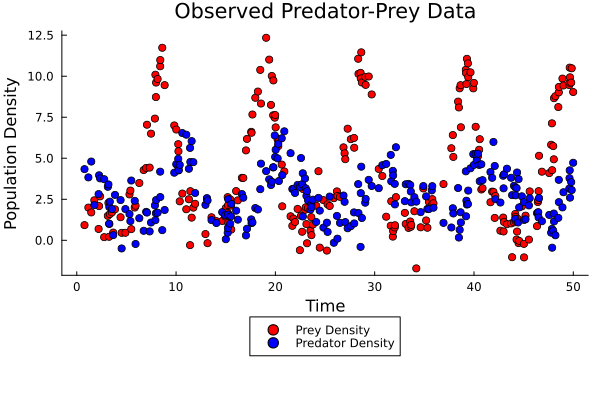
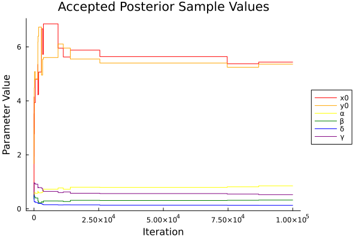
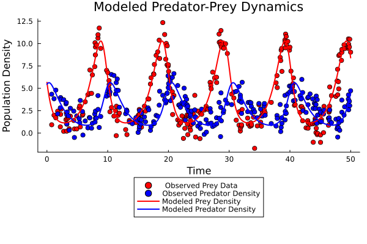
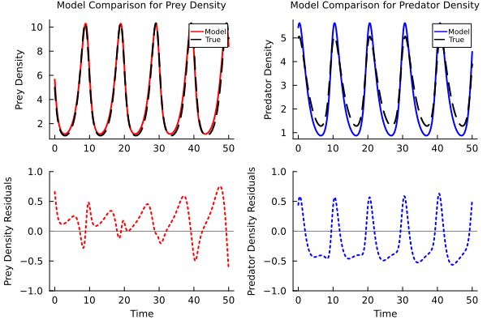

## Repository Overview:

This repository contains scripts for fitting a Lotka-Volterra model to noisy predator-prey data using Bayesian inference. The scripts generate observed data, perform a Markov Chain Monte Carlo (MCMC) simulation utilizing the Metropolis-Hastings Algorithm, and produce visualizations of the results.

Key Files: 

- `src/predator_prey_data.jl`: Generates synthetic predator-prey data and saves it to `data/predator_prey_data.csv`.
- `src/bayesian_analysis.jl`: Performs Bayesian analysis on the generated data and produces visualizations which are saved to `figs/`.
- `src/fns/functions.jl`: Contains additional utility functions such as the Runge-Kutta 4th order method and the Lotka-Volterra equations.

### Lotka-Volterra Model:
 
    dx/dt = αx - βxy
    dy/dt = δxy - γy

    Where:

        x = prey density
        y = predator density

        α = prey birth rate coefficent
        β = coefficent for the effect of the presence of predators on the prey death rate
        δ = coefficent for the effect of the presence of prey on the predator birth rate
        γ = predator death rate coefficent

The Lotka-Volterra model is a system of two non-linear ordinary differential equations which are the time derivative of the prey and predator population densities. In this simulation the equations are solved using a 4th order Runge-Kutta numerical integrator. 

### Install Julia:

Ensure you have Julia installed on your system. Download it here: [Install Julia](https://julialang.org/install/)

### Clone this Repository:

Clone this repository by entering the following command into your computer's terminal:

```
git clone https://github.com/ericdammannjr/Eric-D-GLY6932-Final-Project
```

### Instantiate Dependencies:

Run the following commands in the Julia REPL to install the required packages:

```julia
using Pkg
Pkg.activate("deps")
Pkg.instantiate()
```

### Generate Observed Data:

First run `src/predator_prey_data.jl`. This script will generate noisy predator prey data that will be saved to `data/predator_prey_data.csv`.

### Perform Bayesian Analysis:

Next, run `src/bayesian_analysis.jl`. This script will utilize the functions defined in `src/fns/functions.jl` to fit a Lotka-Volterra model to the data saved at `data/predator_prey_data.csv` with an MCMC simultion using the Metropolis-Hastings algorithm .

**THIS SCRIPT MAY TAKE UP TO 10 MINUTES TO RUN**

Upon completion, it will output the following message in the terminal:

```
MCMC Simulation Completed! All figures were saved to /figs folder.
```

and 4 figures will be generated in the `/figs` folder.

### Visualize Results: 



**Figure 1:** This is a visualization of the raw data generated by `src/predator_prey_data.jl` and saved to `data/predator_prey_data.csv`. Noticeably, there is the characteristic cyclic nature of predator-prey data but with substantial noise and temporal gaps. 



**Figure 2:** This is a visualization of the value of the current accepted parameters given the observed data for the inital conditions and parameters of the Lotka-Volterra equations over the number of iterations. Notice how the lines (for the most part) converge to a specific value as new acceptances become less frequent. 



**Figure 3:** This is a visualization of the raw data and the fitted Lotka-Volterra model with the estimated initial conditions and parameters. From this visual the model seems to fit the data pretty well. We now have a function for the time continuous estimation for predator and prey density!



**Figure 4:** This visualization compares the modeled function with the "true" function used to generate the noisy data. This normally would not be possible because the initial conditions and parameters values would be estimated from real-world observed data and not generated synthetically. However, as an exersise, it showcases the abiltiy of MCMC to estimate parameter values with Bayesian inference from model structures and parameter spaces that are complex and rather large. 